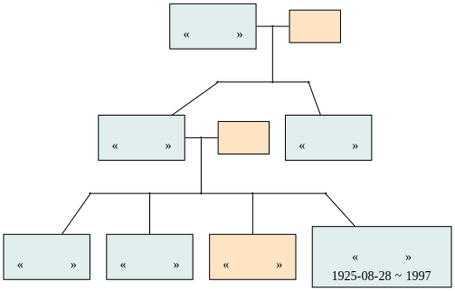

familytreemaker
===============

This program creates family tree graphs from simple text files.

The input file format is very simple, you describe persons of your family line
by line, children just have to follow parents in the file. Persons can be
repeated as long as they keep the same name or id. An example is given in the
file `LouisXIVfamily.txt`.


Installation
------------

Simply clone the repo:
```bash
git clone https://github.com/AbdullahM0hamed/familytreemaker
```

This script outputs a graph descriptor in DOT format. To make the image
containing the graph, you will need a graph drawer such as [GraphViz] [1].

[1]: http://www.graphviz.org/  "GraphViz"

Usage
-----
```
usage: familytreemaker.py [-h] [-a ANCESTOR] [-g GENDER] [-v INFOLEVEL]
                          [-o OUTFILE]
                          INPUTFILE

Generates a family tree graph from a simple text file

positional arguments:
  INPUTFILE     the formatted text file representing the family

optional arguments:
  -h, --help    show this help message and exit
  -a ANCESTOR   make the family tree from an ancestor (if omitted, the program
                will try to find an ancestor)
  -v INFOLEVEL  Information level (0/1/2) to output. (0 - only name and
                surfname will be output; 1 - time of birthday and deathday
                will be invisable; 2 - all information will be output)
  -o OUTFILE    file name for output
```

## Creating Family Tree
Step 1: Create Text File With Ancestor, spouse (optional) must be the same indent level, and children must be indented (not with spaces, but with tab). Example:

```
Father
Mother
	Kid
```

Or without spouse:

```
Father
	Kid
```

Example of multiple generations:

```
Father
Mother
	Kid

Kid
	Grandkid
```

Brackets can be used to add IDs (necessary if multiple people with the same name exist) like so:


```
Father
Mother
	Kid (id=1)

Kid (id=1)
	Grandkid
```

Brackets can also be used to add color, using `color=`, e.g: `(color=pink)` or `(id=1, color=pink)`.

Step 2: Run the script and produce a Graphviz DOT file

```bash
python familytree.py -v0 -o family.dot family.txt
```

Step 3: Produce PDF or Image using dot:

```bash
dot -Tpdf -o family.pdf family.dot
```


